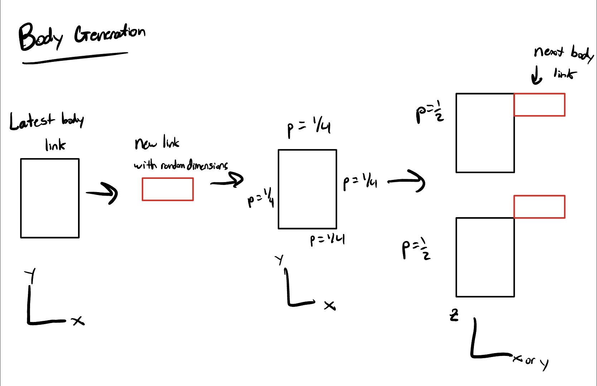

# Assignment 8
Max Paik's  Repo for Assignment 8 for CS 396 Artificial Life at Northwestern University Winter 2023

# Usage

run "python search.py n" 

Here, n is the random seed used by numpy.

# What This Is and How It Works

This codebase showcases evolved robots. Over time, the robots' brains and bodies are optimized for locomotion.
The fitness function rewards robots that travel the furthest in a given direction during the time of the simulation.
Robots are generated randomly using the algorithm described below. 
Evolution occurs both through modification of the body plan and the weights within the robot's brain.
This project showcases alternate potential methods for locomotion that may have evolved in different conditions for life.

# Brain and Body Generation

The first step of body generation is to set an initial number of links in the body. 
After that, my algorithm builds up a body one link at a time. 

The brain is generated by first flipping a fair coin to decide if each body link is given a sensor. 
Each link with a sensor gets a corresponding sensor neuron and each joint a corresponding motor neuron.
Then, the brain is made to be fully connected, meaning every sensor neuron connects to every motor neuron.

This allows for 
I believe these simplifications were necessary because of the otherwise truly random nature of my body generation algorithm, which needed some constraints to produce reasonable robots.

# Brain and Body Mutation

At each evolutionary step, first a fair coin is flipped which decides if the brain or body will be modified in this iteration.
If the brain is chosen to be modified, a given weight is mad

# Credit

This work is based off r/ludobots and makes extensive use of the Pyrosim library. 

TODO: write bodies to file between runs, save bodies in lists, write up README w/ diagrams, evolve bodies or brains